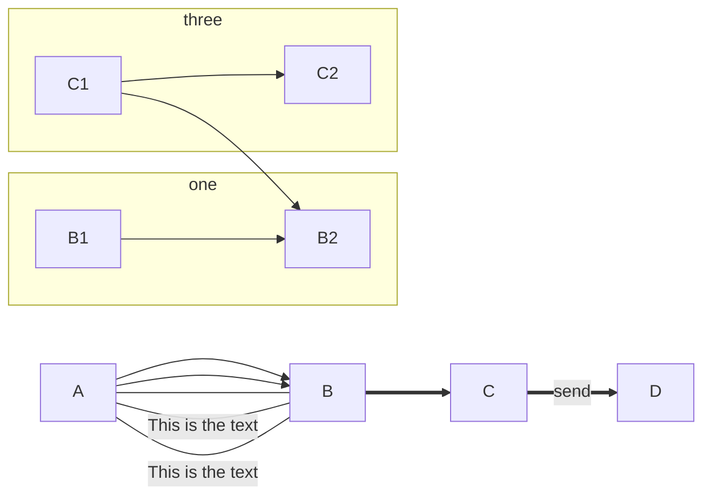

```mermaid
graph LR
    A-->B
    A-->B
    A --- B
    A-- This is the text --- B
    A---|This is the text|B;
    B==>C
    C== send ==>D
    subgraph one
        B1-->B2
    end
    subgraph three
        C1-->C2
    end
    C1-->B2
```
