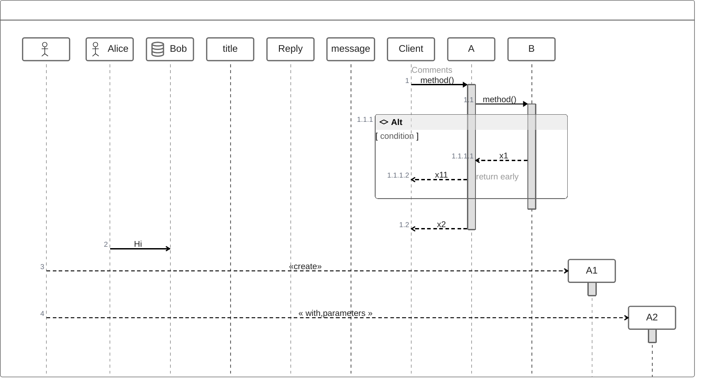

```mermaid
zenuml
    @Actor Alice
    @Database Bob
    title Reply message
    // Comments
    Client->A.method() {
      B.method() {
        if(condition) {
          return x1
          // return early
          @return
          A->Client: x11
        }
      }
      return x2
    }
    Alice->Bob: Hi
    new A1
    new A2(with, parameters)
```
