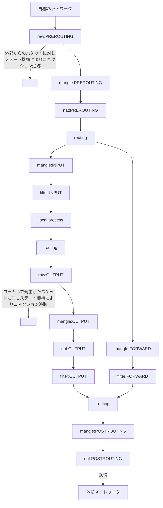

http://oxynotes.com/?p=6361
http://sawara.me/linux/828/
https://forums.docker.com/t/restricting-external-container-access-with-iptables/2225/4

### TIPS
#### Linux NAT Router の作成

```
sudo sh -c 'echo "net.ipv4.ip_forward = 1" >> /etc/sysctl.conf'
sudo sysctl -p
cat /proc/sys/net/ipv4/ip_forward

global_eth=ens160
local_eth=ens192
internal_ip=10.0.0.0/8

iptables -A FORWARD -i $local_eth -o $global_eth -s $internal_ip -j ACCEPT
iptables -A FORWARD -m state --state ESTABLISHED,RELATED -j ACCEPT
iptables -t nat -A POSTROUTING -o $global_eth -s $internal_ip -j MASQUERADE
# -t nat　natテーブルを使用
# -A POSTROUTING　POSTROUTINGチェインを使用し、内部ネットから外部ネットへ出ていくパケットのソースIPを書き換える
# -o eth0　パケットが出ていくインターフェイスをeth0と指定
# -s $internal_ip　ソース側ネットワークアドレスは$internal_ip（192.168.0.0/24）
# -j MASQUERADE　IPマスカレードを行う
iptables -A OUTPUT -o $global_eth -d 10.0.0.0/8 -j DROP
iptables -A OUTPUT -o $global_eth -d 176.16.0.0/12 -j DROP
iptables -A OUTPUT -o $global_eth -d 192.168.0.0/16 -j DROP
iptables -A OUTPUT -o $global_eth -d 127.0.0.0/8 -j DROP
iptables -N LOGGING
iptables -A LOGGING -j LOG --log-level warning --log-prefix "DROP:" -m limit
# iptables -A LOGGING -j DROP
iptables -A INPUT -j LOGGING
iptables -A FORWARD -j LOGGING
```

### memo

```
iptables -L --line-numbers -n
iptables -L --line-numbers -n -v

iptables -D チェイン ルール番号
iptables -I INPUT {行番号} -s {IP/サブネットマスク} -p tcp -m tcp --dport {ポート番号} -j ACCEPT

# example
iptables -I DOCKER -i eth0 -j DROP
iptables -I DOCKER -i eth0 -p tcp -s 172.16.0.0/22 -m state --state NEW -j ACCEPT
iptables -I DOCKER -i eth0 -p tcp -s 192.168.0.0/16 -m state --state NEW -j ACCEPT
iptables -I DOCKER -i eth0 -p tcp -s 127.0.0.1/32 -m state --state NEW -j ACCEPT
iptables -D DOCKER 2
```

### ルールの追加のされ方

```
iptables -t filter -A INPUT -p tcp --dport 22 -j ACCEPT
iptables -t filter -A INPUT -j REJECT
iptables -t filter -L
----
## 実行結果
Chain INPUT (policy ACCEPT)
target     prot opt source               destination
ACCEPT     tcp  --  anywhere             anywhere            tcp dpt:ssh
REJECT     all  --  anywhere             anywhere            reject-with icmp-port-unreachable

...
----

iptables -t filter -I INPUT -p tcp --dport 80 -j ACCEPT
iptables -t filter -I INPUT -p tcp --dport 20:21 -j ACCEPT
----
## 実行結果
Chain INPUT (policy ACCEPT)
target     prot opt source               destination
ACCEPT     tcp  --  anywhere             anywhere            tcp dpts:ftp-data:ftp
ACCEPT     tcp  --  anywhere             anywhere            tcp dpt:http
ACCEPT     tcp  --  anywhere             anywhere            tcp dpt:ssh
REJECT     all  --  anywhere             anywhere            reject-with icmp-port-unreachable

...
----
```

### table

table  | description
-------|-------------------------------------------------------------
filter | パケットフィルタリングを参照するテーブルを指定する。(デフォルトのテーブル)
nat    | 新しいセッションを開くパケットが参照するテーブルを指定する。
mangle | 特別なパケットが参照するテーブルを指定する。(TOS など)
raw    | 追跡除外マークをつけるためのテーブル。

```
# port=80 禁止
iptables -t filter -p tcp --dport 80 -j -DROP
# ip マスカレード指定
iptables -t nat -A POSTROUTING -s 192.168.1.0/24 -j MASQUERADE
# forwarding
iptables -t nat -A PREROUTING -i eth0 -p tcp --dport 80 -j DNAT --to 172.31.0.1:80
# 80 のTOSを高スループットのものに書き換え
iptables -t mangle -A PREROUTING -p tcp --dport 80 -j TOS --set-tos Maximize-Throughput
# ポート443の通信マークをポート80のものと合わせ、マークマッチを使って通信を破棄
iptables -t mangle -A PREROUTING -p tcp --dport 80 -j MARK --set-mark 80
iptables -t mangle -A PREROUTING -p tcp --dport 443 -j MARK --set-mark 80
iptables -t mangle -A PREROUTING -m mark --mark 80 -j DROP
# ポート53のUDPを通ったパケットの受信時と送信時にNOTRACKマークを付ける
iptables -t raw -I PREROUTING -p udp --dport 53 -j NOTRACK
iptables -t raw -I OUTPUT -p udp --dport 53 -j NOTRACK
```

### chain

type        | description                             | table
------------|-----------------------------------------|------------------------
INPUT       | 入力（受信）パケット                    | filter, mangle
OUTPUT      | 出力（送信）パケット                    | filter, nat, mangle, raw
FORWARD     | フォワードするパケット                  | filter
PREROUTING  | 受信時を宛先アドレスを変換するチェイン  | nat, mangle, raw
POSTROUTING | 送信時に送信元アドレスを変換するチェイン| nat

#### テーブルとチェインの関係

 テーブル名         | filter      | nat         | mangle
--------------------|-------------|-------------|------------
 利用できるチェイン | FORWARD     | PREROUTING  | PREROUTING
                    | INPUT       | POSTROUTING | OUTPUT
                    | OUTPUT      | OUTPUT      |


#### ユーザー定義チェイン
- `-N [chain]` で定義できる

#### 各テーブルとチェインの関係について



### target

target    | description
----------|---------------------------------------------------------------------------------------
ACCEPT    | パケットの通過を許可
DROP      | パケットを破棄
RETRUN    | チェーン内のルール評価を終了する
REJECT    | パケットを拒否し、ICMPメッセージを返信
LOG       | Logを採取する
SNAT      | パケットの送信元アドレスを修正する。natテーブルでpostroutingチェーンでのみ利用できる。
DNAT      | パケットの送信先アドレスを修正する。natテーブルでpostroutingチェーンでのみ利用できる。
MASQUERADE| 「-ｔ nat」と「-A POSTROUTING」と同時に用いて送信元IPとポート番号を書き換える
REDIRECT  | 特定ポートにリダイレクト
MARK      | カーネルのなkでのみ維持管理できる特別なフィールド。unsigned int = 4294967296 まで設定可能。

### rule

rule                         |description
-----------------------------|------------------------------------------------------------------------------------------------
-p [!] <protocol>            |ルールで使うプロトコル（tcp、udp、icmp、all）を指定
-s [!] <address> [/<netmask>]|送信元アドレス。IPアドレスのほかにホスト名などでも指定できる
-d [!] <address> [/<netmask>]|接続先アドレス。IPアドレスのほかにホスト名などでも指定できる
--sport <port>               |送信元ポートを指定する。
--dport <port>               |送信先ポートを指定する。
-i <interface>               |パケットが入ってくるインターフェイス（eth0、eth1など）を指定
-o <interface>               |パケットが出ていくインターフェイスを指定
-j <target>                  |パケットがマッチしたときのアクション（ターゲット）を指定
-t <table>                   |テーブル（filter、nat、mangle）を指定
-m <module>                  |モジュールを指定する。-pで暗黙に指定されるので省略することも可。
--icmp-type [!] <type>       |ICMPでタイプ名を指定する。( iptables -p icmp -hで表示されるタイプを指定。
　!                          |-p、-s、-dなどで、条件を反転する。「! 192.168.0.1」とすると、「192.168.0.1以外」という意味になる

### helper module
- /etc/sysconfig/iptables-config の IPTABLES_MODULES の IPTABLES_MODULE に追記

module                  |protocol
------------------------|---------------------
nf_conntrack_amanda     |Amanda
nf_conntrack_ftp        |FTP
nf_conntrack_netbios_ns |NetBIOS Name Service
nf_conntrack_pptp       |PPTP
nf_conntrack_tftp       |TFTP

### state module

state       |description
------------|----------------------------------------------------------------
INVALID     |既存のコネクションとは関係のないパケット
NEW         |新しいコネクションの接続に関するパケット
ESTABLISHED |接続済みコネクションのパケット
RELATED     |接続済みコネクションに関連して発生した新たなコネクションパケット

### command

command                   |description
--------------------------|--------------------------------------------------------------------------
ptables [ -t <table> ] -A |append。最後尾に追加。
iptables [ -t <table> ] -L|line-numbers。設定内容表示。
iptables [ -t <table> ] -D|delete。既存のルールの削除。
iptables [ -t <table> ] -F|flush。指定したチェーン全てを削除。
iptables [ -t <table> ] -I|insert。先頭にチェーンを追加。ルール番号を指定することで任意の場所に挿入。
iptables [ -t <table> ] -P|チェーン内全体で有効なポリシーを定義。デフォルトはAccept。
iptables [ -t <table> ] -N|new。新しいチェーンを作成。


#### icmp

type|description
----|-----------------------
0   |Echo Reply
3   |Destination Unreachable
4   |Source Quench
5   |Redirect
8   |Echo Request
11  |Time Exceeded
12  |Parameter Problem
13  |Timestamp Request
14  |Timestamp Reply
15  |Information Request
16  |Information Reply
17  |Address Mask Request
18  |Address Mask Reply

```
# icmp 許可
/sbin/iptables -A INPUT -p icmp -j ACCEPT
/sbin/iptables -A OUTPUT -p icmp -j ACCEPT
/sbin/iptables -A FORWARD -p icmp -j ACCEPT
# ping
/sbin/iptables -A INPUT -p icmp --icmp-type 8 -j ACCEPT
/sbin/iptables -A OUTPUT -p icmp --icmp-type 0 -j ACCEPT
```

### hashlimit

args                            |description
--------------------------------|----------------------------------------------------
-m hashlimit                    |hashlimitモジュールを使用する
-hashlimit-burst 5              |規定時間内に5パケット受信すればリミットを有効にする
-hashlimit 1/m                  |リミット時には1分間に1パケットを上限とする
-hashlimit-mode srcip           |ソースIPを元にアクセスを制限する
-hashlimit-htable-expire 120000 |リミットの有効期間。単位はmsで120000は2分間。
-hashlimit-name ssh-limit       |送信元IPを記録するファイル名。


